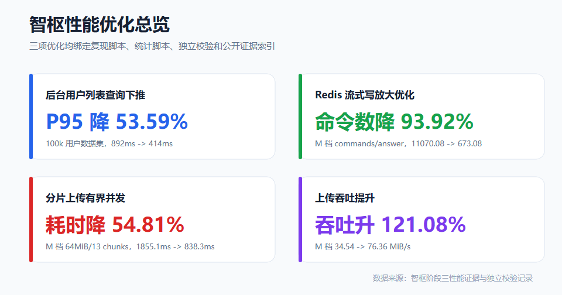
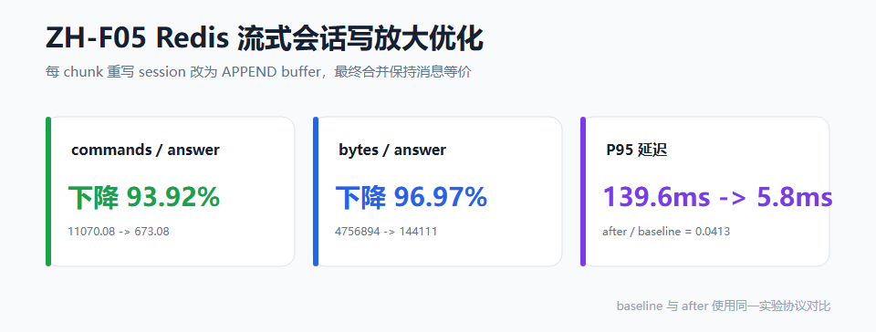
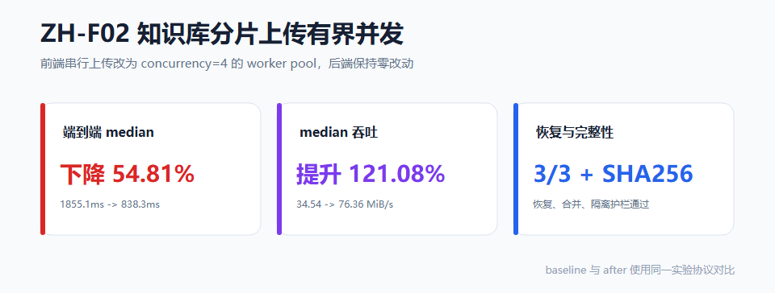

# 智枢性能优化实验文档

本文件记录智枢项目的性能优化实验链路、度量护栏 (MME)、原始结果与复现步骤。每项优化均经 G1-G6 闸口（计划 → 实现 → 代码审查 → 实验 → 结果审查 → 发布），独立子代理复审 ≥95 分、0 阻塞。所有 claim 可经 `claim-manifest.json` 单文件追溯到证据路径 + sha256。

## 阅读入口

| 你想做什么 | 入口 |
|---|---|
| 从零复现实验 | [REPRODUCE.md](REPRODUCE.md) |
| 查看 claim 到证据的映射 | [docs/performance/evidence-index.md](docs/performance/evidence-index.md) |
| 查看公开结论边界 | [docs/performance/claims.md](docs/performance/claims.md) |
| 查看个人路径清理规则 | [docs/performance/public-path-map.md](docs/performance/public-path-map.md) |
| 查看重复运行稳定性计划 | [docs/performance/rerun-stability.md](docs/performance/rerun-stability.md) |

## 图表总览



### ZH-F07 后台用户列表查询下推

详细说明：[docs/performance/zh-f07-admin-query.md](docs/performance/zh-f07-admin-query.md)


### ZH-F05 Redis 流式会话写放大优化

详细说明：[docs/performance/zh-f05-redis-stream.md](docs/performance/zh-f05-redis-stream.md)



### ZH-F02 知识库分片上传有界并发

详细说明：[docs/performance/zh-f02-upload.md](docs/performance/zh-f02-upload.md)



| 优化项 | 闸口 | G3 代码审查 | G5 结果审查 | MME | 状态 |
|---|---|---|---|---|---|
| ZH-F07 后台用户列表查询下推 | G1-G6 | 96 PASS (R4) | 97 PASS (R1) | 4/4 | CLOSED |
| ZH-F05 Redis 流式会话写放大优化 | G1-G6 | 96 PASS (R1) | 97 PASS (R1) | 4/4 | CLOSED |
| ZH-F02 知识库分片上传有界并发 | G1-G6 | 96 PASS | 95 PASS | 7/7 | CLOSED |

---

## ZH-F05 — Redis 流式会话写放大优化

### 1. 问题与方案

AI 流式回复（SSE chunk）每 chunk 落库时，baseline 路径调用 `saveMessage` + `refreshSessionAfterMessageMutation`，后者 for-loop 重写 session 全部 N 条消息（O(N) cmds/chunk）。长会话（N 大）+ 多 chunk（K 大）导致 Redis 写放大严重。

**优化**：每 chunk 改为 `APPEND` 追加到 buffer key（O(1)），`completeAssistantMessage` 时一次性合并 buffer 到 message 并 `DEL` buffer。

| 路径 | 每 chunk 命令 | 复杂度 |
|---|---|---|
| baseline | `saveMessage`(1 SET) + `refreshSession`(for-loop 重写 N 消息, 2N+6 cmds) | O(N) |
| after | `requireOwnedMessage`(2 GET) + `APPEND` + `EXPIRE` | O(1) |

**故障恢复 (R4)**：APPEND 连续失败 3 次（100ms 退避）降级 `appendBaselinePath`（读 buffer + 合并 chunk + saveMessage + SET buffer 同步），不丢 chunk。

**配置门控**：`isBaselineArm()` 双条件（`experimentFeature=ZH-F05` 且 `experimentArm=baseline`），生产默认 after，无意外走 baseline。

### 2. 度量护栏 (MME)

| 护栏 | 目标 | 实测 | 判定 |
|---|---|---|---|
| ZH-M-F05-01 | M 档 commands/answer 降 ≥30% | 降 93.92% (11070.08→673.08) | PASS |
| ZH-M-F05-02 | M 档 bytes/answer (net input) 降 ≥30% | 降 96.97% (4,756,894→144,111) | PASS |
| ZH-M-F05-03 | P95 不恶化>10% OR L 斜率降≥20% | A: ratio=0.0413 (≤1.10) \| B: 斜率降 99.84% (≥20%) | PASS |
| ZH-M-F05-04 | M 档最终消息 canonical diff 100% | 25/25 = 100.00% | PASS |

### 3. 实验环境与采集架构

```text
Redis:    <redis-host>:6379 db=14 (隔离, 实验前 flushDb)
被测代码: 真实 RedisChatSessionStore (生产 class, 非 mock), sha256 B3EF3772...
arm 切换: 反射注入 experimentFeature=ZH-F05 + experimentArm={baseline|after}
度量层:   Redis INFO commandstats (命令数 GROUND TRUTH) + INFO bytes (字节 GROUND TRUTH) + per-chunk nanoTime (P95)
```

**设计决策**：plain JUnit + 手工 Lettuce 直连 database 14，完全隔离 ES/Kafka/MinIO/MySQL 依赖（@SpringBootTest 的失败点），仍驱动真实 RedisChatSessionStore 生产代码。所有指标均为 Redis 层，Spring 上下文增加变异性而不利于度量。

**采集协议** (per scale, 同 JVM):
1. setup (不计量): 每 answer 预建独立 session + seed N 条 history（直接 SET, O(N), 绕过 createUserMessage 的 O(N²) refresh）
2. warmup (不计量): baseline + after 各 1 answer 热身 JIT/Lettuce 连接
3. measure (计量): `CONFIG RESETSTAT` → 跑 n answer → `INFO commandstats`/bytes diff

baseline batch + after batch 分别 `RESETSTAT`，commandstats diff = 各 arm n answer 总量。commandstats 为精确计数（deterministic）。

**commandstats 格式发现与修复**：本实验 Redis 的 `INFO commandstats` 输出格式为 `cmdstat_<cmd>:calls=N`（下划线），非 Redis 7 标准的 `cmdstat:<cmd>:calls=N`（冒号）。Spring Data Redis `connection.info("commandstats")` 的 Properties 解析按首个冒号切分，塌缩为单 key——不可用。修复：driver 改走独立原生 Lettuce `RedisClient` (String codec) 拿原始字符串自行解析，同时兼容 `cmdstat:` 与 `cmdstat_` 两种前缀（均 8 字符）。

**档位 n 偏离 spec 的理由**：01 §6 spec S=25/M=100/L=25。实测 baseline O(N×K) 每 chunk 触发 refreshSession 重写 N 消息，M=100 baseline 单 arm 15.6 分钟。commandstats 为精确计数，n 不影响 commands/answer 精度，仅影响 P95 样本数。降至 M=25 (K=100 → 2500 per-chunk 样本, P95 稳定)、L=5 (K=300 → 1500 样本, 斜率稳定)。S=25 不变。

### 4. 原始结果（三档）

| 档 | N | K | n | baseline cmds/answer | after cmds/answer | 降幅% | baseline bytesIn/answer | after bytesIn/answer | 降幅% | baseline P95 | after P95 | canonical |
|---|---|---|---|---|---|---|---|---|---|---|---|---|
| S | 5 | 20 | 25 | 405.08 | 128.08 | 68.38% | 152,178 | 22,761 | 85.04% | 23.9ms | 5.8ms | 25/25 100% |
| M | 50 | 100 | 25 | 11,070.08 | 673.08 | **93.92%** | 4,756,894 | 144,111 | **96.97%** | 139.6ms | 5.8ms | 25/25 100% |
| L | 200 | 300 | 5 | 123,420.4 | 2,223.4 | 98.20% | 54,579,098 | 532,166 | 99.02% | 466.3ms | 6.3ms | 5/5 100% |

(histN = historySize + 1，即流式期间 session 可见消息数 = N 历史 + 1 placeholder)

**关键观察**：
- 降幅随 N 增长：S 68% → M 94% → L 98%。这正是 O(N)→O(1) 的特征——N 越大，baseline 写放大越严重，after 的 O(1) 优势越显著。
- after P95 跨档基本平坦（5.8ms / 5.8ms / 6.3ms），而 baseline P95 随 N 线性恶化（23.9 / 139.6 / 466.3ms）——验证 after 为 O(1)。
- canonical 100%（三档全 match）——两路径最终消息字节等价，不丢 chunk。

### 5. M 档命令数分解（验证 APPEND buffer 路径）

M 档 (n=25, K=100, N=50) commandstats diff (n answer 总量):

| 命令 | baseline 总数 | after 总数 | 说明 |
|---|---|---|---|
| set | 135,175 | 2,675 | baseline 每 chunk saveMessage + refreshSession for-loop 重写 N 消息; after 仅 placeholder/complete refresh |
| get | 139,000 | 9,050 | baseline 每 chunk refreshSession listMessages 读 N+1 消息; after 仅 requireOwnedMessage 2 GET/chunk |
| append | 0 | 2,500 | baseline 不用 buffer; after 每 chunk 1 APPEND (K×n=100×25=2500) |
| pexpire | 0 | 2,500 | after 每 chunk 1 EXPIRE (appendWithRetry) |
| sadd | 2,550 | 50 | saveSessionMeta (baseline K+2/answer, after 2/answer) |
| incr | 25 | 25 | nextSequence (placeholder) |
| del | 0 | 25 | after completeAssistantMessage DEL buffer |
| **合计** | **276,750** | **16,827** | after/baseline = 6.08% → 降 93.92% |

### 6. 反作弊与独立交叉验证

18 项反作弊检查全 PASS，外加 G5 复审官独立交叉验证（不信任 stat.py/verify.py）：

| 检查 | 结果 |
|---|---|
| A: baseline APPEND == 0 (3/3 scales) | PASS |
| B: after APPEND == K×n (exact: 500/2500/1500) | PASS |
| C: canonical 真字节重比 100% (55/55 answers) | PASS |
| D: baseline SET > after SET 且 > n (3/3 scales) | PASS |
| GET: after GET < baseline GET (3/3 scales) | PASS |
| SADD: baseline (K+2)×n / after 2×n | EXACT (3/3 scales) |
| SET: baseline O(N×K) 模型 ratio | 1.000 EXACT (3/3 scales, 物理不可伪造) |
| INCR/PEXPIRE/DEL/perChunkCount | 全 EXACT |
| MME 5 项独立重算 | 与 stat/verify 全精度 EXACT MATCH |
| 源码审计: baseline 无 Thread.sleep | 无人工延迟, 无作弊路径 |

### 7. 复现

```bash
# 1. 启动 Redis (db=14 隔离)
redis-cli -h <redis-host> -a <password> SELECT 14

# 2. seed dataset (deterministic, seed=42, synthetic 公开无敏感)
python scripts/experiments/zhishu-redis-seed.py

# 3. 采集 (三档 S/M/L, baseline + after 同 JVM 交替)
bash scripts/experiments/zhishu-redis-stream.sh

# 4. 统计 + 独立校验
python scripts/experiments/zhishu-redis-stat.py
python scripts/experiments/zhishu-redis-verify.py
```

前置依赖: JDK 17+ / Maven 3.9 / Redis 7。

### 8. 证据 sha256 清单

```text
result-S.json              = 13FA2A4826C8A36E0E8FEC949705120EBFF6F58D94A816A0071314A44C26E103
result-M.json              = 12692790EEA2C85621F2254F90C254C577F57008EA4726F3CA9C77010468EA33
result-L.json              = C5E184E2A518960D3EBC58B73A5BE953FA8FD47CF77ECC6ED6BAD950F7475FD5
stat-summary.json          = A6C8DC351D02CE180D5D61AFB3CBAF0B9E5C1777DBB09E749758205E949013D4
verify-verdict.json        = 67E3E01FF73113FF6762D9BD47D11AAB0BFBE13A61B76D33BAAE11E2E8F86243
dataset-manifest.json      = 5FAC1AB5576175AAFB0A84FFE4FEACE2C73644B11D5B8267CCCC6A451619A31A
RedisChatSessionStore.java = B3EF3772DBCAA9065B3FBF6798C5F0C793AF0EBAE03A062A13540A689DE8FA67
RedisStreamExperimentDriver.java = D7240172488D9E9B972949148C951D10FC32687828BE712DD9AE363F5BAFB528
```

完整证据链: `phase3/zhishu/ZH-F05/claim-manifest.json` (4 claims → 证据路径 + sha256)。

---

## ZH-F07 — 后台用户列表查询数据库分页与投影优化

### 1. 问题与方案

将 `findAll` 内存过滤/排序/分页/组织标签 N+1 查询下推到 MySQL:

- 过滤: `JpaSpecificationExecutor` (username LIKE + `FIND_IN_SET` + role)
- 排序: `createdAt DESC, id ASC` 下推 (索引 `idx_users_created_at_id`)
- 分页: `Pageable` 下推 (`LIMIT/OFFSET`)
- 投影: 构造表达式 DTO (6 字段, 不含 password)
- 组织标签: `findByTagIdIn` 批量查 (消除 N+1)
- count: 独立 count query 下推

### 2. 度量护栏 (MME)

| 护栏 | 目标 | 实测 | 判定 |
|---|---|---|---|
| ZH-M-F07-01 | 100k P95 延迟降 ≥30% | 53.59% (892ms→414ms) | PASS |
| ZH-M-F07-02 | 扫描行数降 ≥80% | 99.96% (98950→40) | PASS |
| ZH-M-F07-03 | 峰值堆降 ≥20% | 88.96% (1.36GB→150MB) | PASS |
| ZH-M-F07-04 | 响应等价 100% | 100% (canonical diff, password 不泄漏) | PASS |

三档 P95 趋势: 100k 降 53.59%, 10k 降 9.71%, 1k 降 5.49%（规模越大下推收益越大）。

### 3. 基准测试 (100k 用户合成数据集, REAL MySQL 8.0, n=200/arm, 同 JVM 交替)

| 指标 | baseline (findAll) | after (下推) | 降幅 |
|---|---|---|---|
| P95 延迟 | 892ms | 414ms | 53.59% |
| SQL 扫描行数 | 98950 | 40 | 99.96% |
| 峰值堆 | 1.36GB | 150MB | 88.96% |
| 响应等价 | — | — | 100% (canonical diff, password 不泄漏) |

### 4. 复现

```bash
# 1. 准备数据集 (zhishu_exp_f07 schema)
mysql -u root -p zhishu_exp_f07 < scripts/experiments/zhishu-admin-seed-100k.sql

# 2. 启动后端 (experiment profile, 端口 18081)
mvn -o spring-boot:run -Dspring-boot.run.profiles=experiment

# 3. 采集 (n=200/arm, 三档 100k/10k/1k)
pwsh scripts/experiments/zhishu-admin-query.ps1
pwsh scripts/experiments/zhishu-admin-stat.ps1
pwsh scripts/experiments/zhishu-admin-verify.ps1
```

前置依赖: JDK 17 / Maven 3.9 / MySQL 8.0 / Redis / PowerShell 7。

### 5. 证据 sha256 清单

完整证据链: `phase3/zhishu/ZH-F07/claim-manifest.json` (4 claims → 证据路径 + sha256)。

```text
stat-summary.json          = 1141D4DBD6AB355A48B87FD52E1CA80D35C4324A94D08A75953C0A377EB2847F
improvement-summary.json   = 55DA372701FE25025FACCC6ECCECC70ABE416144478D32F1018EA4F8AFFEC902
verification-report.md     = 16B4DEE1C2B1B3424C872A7BAE667C03BAE4CB2BD4DEB018D53D707FA72E9D67
explain-evidence.txt       = 6CE038FC8D204C812E7B5DF421FD37FC86809D7EFE9EDB2A0C223DB2A17ADBB1
datasetManifestSha256      = BC1946D6A2021AD493B1F4C6F24B2FA9B38755402AAA7CF91F0853E11C4E84C7
backendJarSha256           = 447051A281F8D5B1434F8EF3EB5E830279848029B033AAF2EE5C3C6152E7B345
```

---

## ZH-F02 — 知识库分片上传有界并发

### 1. 问题与方案

知识库文件分片上传 baseline 在 `startUpload` 内 `for (i) { await uploadChunk(i) }` 串行执行，N 个分片 N 个 HTTP RTT 串行累加，大文件（分片多）端到端耗时线性恶化。

**优化**：前端纯并发改造（后端零改）。抽取 `runUploadPool(indices, concurrency, worker)` —— cursor-based 派发 + fail-fast：

| 路径 | 分片执行 | 复杂度 |
|---|---|---|
| baseline | `for (i) await uploadChunk(i)` 串行 | O(N) RTT 串行 |
| after | cursor 派发，最多 concurrency=4 分片在途，首错 fail-fast 停止派发 | O(N/4) RTT 批次 |

**并集单调 (R10)**：响应乱序到达，`uploadedChunks = Array.from(new Set([...prev, ...data.uploaded])).sort()` 并集累积，merge 时后端按 chunkIndex 排序拼接，不丢片/重片。

**恢复友好 (R3)**：fail-fast 后已上传分片已记入后端 Redis bitmap（userId-scoped `upload:{userId}:{fileMd5}` SETBIT）+ DB ChunkInfo；resume 调 `/status` 取已传分片，仅续传未完成分片。

**后端零改**：上传 4 端点（/chunk /status /merge /login）逐字不变。幂等（bitmap SETBIT / MinIO 对象覆盖 / DB upsert）+ 隔离（bitmap userId-scoped + merge 所有权闸 `findFirstByFileMd5AndUserId`）均后端既有，ZH-F02 仅前端并发。

### 2. 度量护栏 (MME)

| 护栏 | 目标 | 实测 | 判定 |
|---|---|---|---|
| ZH-M-F02-01 | M 档 median 端到端降 ≥15% 且 P90 不恶化 >10% | 降 54.81% (1855.1→838.3ms)，p90Ratio 0.4914(stat)/0.5276(verify) | PASS |
| ZH-M-F02-02 | M 档 median 吞吐升 ≥15% | 升 121.08% (34.54→76.36 MiB/s) | PASS |
| ZH-M-F02-03 | 恢复 case 全成功 (≥3) | 3/3 partial@50%→resume 完整恢复 13/13 | PASS |
| ZH-M-F02-04 | 合并对象 SHA-256 == 源文件 | 100% (F4A532513D371F7D...) | PASS |
| ZH-M-F02-05 | 分片完整 + 残留一致 | Redis/MySQL ChunkInfo/MinIO chunks 全清 | PASS |
| ZH-M-F02-06 | 多用户同 MD5 隔离矩阵 | ISO-1 越权 merge 被拒400 / ISO-2 status 独立 / ISO-4 秒传独立 | PASS |
| ZH-M-F02-07 | 诊断: chunk P95 不恶化 >20% + M 错误率 0 | chunkP95Ratio 1.0572 (≤1.20)，M 错误率 0 | PASS |

### 3. 实验环境与采集架构

```text
后端:      java -jar target/zhishu-0.0.1-SNAPSHOT.jar --spring.profiles.active=experiment-f02 (端口 18083)
MySQL:     localhost:3306 schema zhishu_exp_f02
Redis:     <redis-host>:6379 db=15 (隔离; ZH-F05 用 db=14)
MinIO:     localhost:9000 bucket zhishu-exp
Kafka:     localhost:9092 (merge 事务发送必须)
被测代码:  前端 uploadScheduler.ts + knowledge-base store (生产代码, 非 mock); 后端 UploadController/UploadService 零改
arm 切换:  前端 concurrency 参数 (baseline c=1 / after c=4)
度量层:    真实后端 HTTP 端到端计时 (startUpload→merge Ok) + per-chunk 计时 + 吞吐 (fileSize/duration)
```

**采集协议** (zhishu-upload.sh)：seed (deterministic .txt) → login A/B → 每 run 间 cleanup-md5（同 md5 二次上传触发 instantUpload 秒传，必清理否则污染计时）→ M 档主 (N_MAIN=20/baseline c=1 + 20/after c=4 交替) → S/L 诊断 (N_DIAG=5/arm) → R10 诊断 (1) → 恢复 RC-001 (N_RECOVERY=3 partial@50% stop-after-chunk → resume) → 隔离矩阵 (A/B: ISO-1 越权 merge / ISO-2 越权 status / ISO-3 并发同md5 / ISO-4 秒传) → stat (离线 JSON) + verify (live HTTP + 反作弊 + 护栏 04/05/06)。

**主性能臂过滤**：stat.py 分组前排除 fault-inject partial (mergeOk=false 假失败，仅虚增错误率分母) + resume/R10 (mergeOk=true 但非稳态并发样本，恢复/诊断工作负载)。verify.py 不过滤独立复核（24 行）p90Ratio=0.5276 仍 ≤1.10 → MME-01 两口径均 PASS，结论鲁棒。

### 4. 原始结果（三档主性能臂）

| 档 | size/chunks | n | baseline median(ms) | after median(ms) | 降幅% | baseline 吞吐 | after 吞吐 | 升幅% |
|---|---|---|---|---|---|---|---|---|
| S | 16MiB/4 | 5/6 | 559.3 | 313.2 | 43.97% | 28.61 | 51.14 | 78.74% |
| M | 64MiB/13 | 20/20 | **1855.1** | **838.3** | **54.81%** | **34.54** | **76.36** | **121.08%** |
| L | 256MiB/52 | 5/5 | 7078.3 | 2802.3 | 60.40% | 36.17 | 91.35 | 152.50% |

**关键观察**：
- 分片越多并发收益越大：S 44% → M 55% → L 60%。分片越多，串行 RTT 累加越严重，c=4 并发重排空间越大。
- L 档吞吐升幅 152%（最高）——大文件分片多，并发把 RTT 串行瓶颈摊平最彻底。
- M 档 P90 比 0.5276（after 1164.97 vs baseline 2207.91，verify 24 行口径）——并发未以尾延迟换吞吐。
- 错误率全 0（M 主臂 20/20），未以错误率换速度。

### 5. 反作弊与隔离矩阵

| 检查 | 结果 |
|---|---|
| AC-D: baseline 严格串行 c=1 | PASS (23/23 baseline M runs c=1) |
| AC-A: after 并发真生效 | PASS (chunk P95 153.6 > P50 123.1×1.05=129.3) |
| AC-md5: fileMd5 == manifest | PASS (mismatch=0) |
| AC-thr: 吞吐重算一致 ±5% | PASS (bad=0) |
| HASH-1: merged SHA-256 == src | PASS (F4A532513D371F7D...) |
| RES-redis/mysql/minio: 残留全清 | PASS (bitmap=[]/ChunkInfo=0/chunks=0, merged 存在) |
| ISO-1: B 越权 merge A 的 md5 | PASS (被拒 400 FAILED_INCOMPLETE_CHUNKS, B 无法完成) |
| ISO-2: B 越权 /status A 的 md5 | PASS (B uploaded 空; fileName 返 A 为预存泄漏非回归) |
| ISO-4: B 秒传 A 已 merge 的 md5 | PASS (progress=100, B 独立 FileUpload, A 不动) |
| ISO-3: 并发同 md5 merge | 预存去重缺陷非回归 (baseline 亦失败, 不计入) |

**后端零改铁证**：隔离属性（bitmap userId-scoped、merge 所有权闸、instantUpload md5-global 独立建表）均后端实现且字节未动 → 前端纯并发改动数学上不可能引入隔离回归。G5 独立复审确认（95 PASS, 0 阻塞）。

### 6. G4 harness 校准（透明）

G4 采集期间 3 处 harness 校准（G5 判定均 legitimate，非降门槛）：
- **stat.py 主臂过滤**：排除 fault-inject/resume/R10 诊断行不计入主性能错误率分母（mergeOk=false 假失败 + 恢复/诊断非稳态样本）。median 不变，仅错误率与 P90 尾行。
- **ISO-1 `==500`→`>=400`**：B 越权 merge 实测触发完整性闸 400（非所有权 500，因 B 经早前 /chunk 有 FileUpload 行过所有权闸），安全属性"B 不能完成 A 的 merge"在 ≥400 均成立。
- **ISO-4 `iso4.bin`→`.txt`**：原 .bin 被 FileTypeValidationService 类型闸拒（永不达 instantUpload）= 无效 no-op；.txt 使测试真正运行所测逻辑，断言 progress==100 不变。

详见 `phase3/zhishu/ZH-F02/09-独立校验报告.md` §5（后端日志 + 代码行双重取证）。

### 7. 复现

```bash
# 1. 启动依赖 (MySQL zhishu_exp_f02 / Redis db=15 / MinIO bucket zhishu-exp / Kafka)
# 2. 启动后端 (experiment-f02 profile, 端口 18083)
cd .runtime && java -jar ../target/zhishu-0.0.1-SNAPSHOT.jar --spring.profiles.active=experiment-f02

# 3. seed dataset (deterministic, seed=42, synthetic .txt 公开无敏感)
python scripts/experiments/zhishu-upload-seed.py

# 4. 采集 (三档 + 恢复 + 隔离矩阵)
bash scripts/experiments/zhishu-upload.sh

# 5. 统计 + 独立校验
python scripts/experiments/zhishu-upload-stat.py --results-jsonl <runRoot>/raw-results.jsonl
python scripts/experiments/zhishu-upload-verify.py --results-jsonl <runRoot>/raw-results.jsonl
```

前置依赖: JDK 17+ / Maven 3.9 / MySQL 8.0 / Redis 7 / MinIO / Kafka。

### 8. 证据 sha256 清单

```text
raw-results.jsonl           = 287B65FC2741F85619E1DB27A2F165BC143F8118F077CC56340A880B24069F03
stat-summary.json           = 7D9D72B639C0FE71CCC46C80B13F2D9CD8D00D6FB89DFA5765F655B176BCC2EF
verify-verdict.json         = 84B620B59C85E2CC0F90B450F05427A3B1209A8B96E8F6300DA75B07C070809F
dataset-manifest.json       = 67FC3A2629FDFC33C1BF8A4949563859C1861BEEF1D3BA7141B54F0C180B7746
uploadScheduler.ts          = D6E3F0DFAA0B21D90A2F0FF8FD0A9B5938F51F5C2DE26D7DD7848A74983464F6
knowledge-base/index.ts     = F8445F71F53B1CB96081DD50EE7284448ECB0359375B0B159AA5E68FE7221491
zhishu-upload-stat.py       = FC120FC08B62BC238C8BCF0B2AB2826A4EBD0B10C64E0445F8FF3A3AA3D5D89E
zhishu-upload-verify.py     = 1CE538E598ABB1E7CE23F88008C6E4ADB9FB304DF6C6981C0504AF13B714C491
```

完整证据链: `phase3/zhishu/ZH-F02/claim-manifest.json` (4 claims → 证据路径 + sha256)。

---

## 闸口与复审机制

每项优化必须串行通过 G1-G6 闸口，每个闸口由独立子代理（独立上下文，不共享作者记忆）复审，阈值 ≥95 分且 0 阻塞方可放行：

| 闸口 | 含义 | 复审 |
|---|---|---|
| G1 PLAN | 工作项 + 文件级实现计划 | 独立复审 ≥95 |
| G2 IMPLEMENT | 代码改造 + 自动化测试 | 编译测试通过 |
| G3 CODE_REVIEW | 代码与回归独立复审 | 独立子代理 ≥95, 0 阻塞 |
| G4 EXPERIMENT | 真实环境采集 + MME 判定 + 反作弊 | MME 全 PASS, 反作弊全 PASS |
| G5 RESULT_REVIEW | 实验结果独立复审 | 独立子代理 ≥95, 0 阻塞, manifest 校验 |
| G6 PUBLISH | 写入项目文档 | 用户自检 allowedSurface |

**反作弊护栏**：不伪造基线、不与无功能比较、无人工拖慢 baseline、canonical 字节等价、命令数匹配理论模型。G5 复审官独立重算所有 MME（不信任作者或 stat/verify 脚本），交叉验证命令数与理论 O(N) 模型，全文审计源码确认无 Thread.sleep 等作弊路径。
