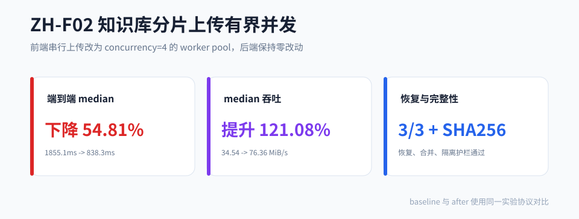

# ZH-F02 知识库分片上传有界并发

## 1. 问题

知识库分片上传 baseline 在前端用 `for + await uploadChunk` 串行上传。文件越大、分片越多，端到端耗时越接近 N 个 HTTP RTT 的串行累加。

## 2. 改造方案

前端引入有界并发 worker pool：

- `runUploadPool(indices, concurrency, worker)` cursor 派发。
- baseline 使用 concurrency=1，after 使用 concurrency=4。
- 首错 fail-fast，停止派发新分片。
- 响应乱序时通过 uploaded chunk 并集单调合并，避免丢片。
- 后端零改，复用既有 Redis bitmap、MinIO 覆盖写、DB upsert 与 merge 所有权闸。

## 3. 核心结果

| 指标 | baseline | after | 变化 |
|---|---|---|---|
| M 档 median 端到端 | 1855.1ms | 838.3ms | 降 54.81% |
| M 档 median 吞吐 | 34.54 MiB/s | 76.36 MiB/s | 升 121.08% |
| L 档 median | 7078.3ms | 2802.3ms | 降 60.40% |
| 恢复 | - | 3/3 完整恢复 | PASS |
| 合并 SHA-256 | - | 等于源文件 | PASS |



## 4. MME 判定

| 护栏 | 目标 | 实测 | 判定 |
|---|---|---|---|
| M 档 median | 降 ≥15%，P90 不恶化 >10% | 降 54.81%，P90 ratio 0.5276 | PASS |
| M 档吞吐 | 升 ≥15% | 升 121.08% | PASS |
| 恢复 | ≥3 case 全成功 | 3/3 | PASS |
| 合并对象 SHA-256 | 等于源文件 | 100% | PASS |
| 残留一致 | Redis/MySQL/MinIO 清理正确 | PASS | PASS |
| 多用户同 MD5 隔离 | 越权 merge/status 阻断或隔离 | PASS | PASS |
| chunk P95 与错误率 | P95 不恶化 >20%，错误率 0 | PASS | PASS |

## 5. 复现

```bash
cd .runtime
java -jar ../target/zhishu-0.0.1-SNAPSHOT.jar --spring.profiles.active=experiment-f02

cd ..
python scripts/experiments/zhishu-upload-seed.py
bash scripts/experiments/zhishu-upload.sh
python scripts/experiments/zhishu-upload-stat.py --results-jsonl <runRoot>/raw-results.jsonl
python scripts/experiments/zhishu-upload-verify.py --results-jsonl <runRoot>/raw-results.jsonl
```

## 6. 证据

| 证据 | 值 |
|---|---|
| raw-results sha256 | `287B65FC2741F85619E1DB27A2F165BC143F8118F077CC56340A880B24069F03` |
| stat-summary sha256 | `7D9D72B639C0FE71CCC46C80B13F2D9CD8D00D6FB89DFA5765F655B176BCC2EF` |
| verify-verdict sha256 | `84B620B59C85E2CC0F90B450F05427A3B1209A8B96E8F6300DA75B07C070809F` |

## 7. 边界

54.81% 和 121.08% 绑定 M 档 64MiB/13 chunks 的固定环境。不同网络、对象存储、文件大小和并发配置下比例会变化。公开结论应表达为“固定实验数据集上测得”，不写成所有上传场景的绝对收益。
