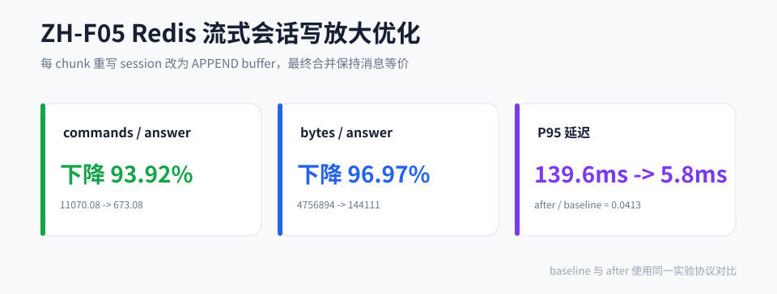

# ZH-F05 Redis 流式会话写放大优化

## 1. 问题

AI 流式回复每个 chunk 都走 `saveMessage + refreshSessionAfterMessageMutation`，baseline 会随着会话历史 N 增大而反复重写 session 消息，形成 O(N) 写放大。

## 2. 改造方案

将每 chunk 写入改为 `APPEND` 到 buffer key：

- 每 chunk 只做 owner check、`APPEND` 和 `EXPIRE`。
- `completeAssistantMessage` 时一次性合并 buffer。
- APPEND 连续失败后降级 baseline 路径，避免丢 chunk。
- 通过 `experimentFeature=ZH-F05` 与 `experimentArm=baseline` 双条件保留 baseline arm。

## 3. 核心结果

| 指标 | baseline | after | 变化 |
|---|---|---|---|
| M 档 commands/answer | 11070.08 | 673.08 | 降 93.92% |
| M 档 bytes/answer | 4,756,894 | 144,111 | 降 96.97% |
| M 档 P95 延迟 | 139.6ms | 5.8ms | after/baseline = 0.0413 |
| 最终消息等价 | - | 100% | PASS |



## 4. MME 判定

| 护栏 | 目标 | 实测 | 判定 |
|---|---|---|---|
| commands/answer | M 档降 ≥30% | 降 93.92% | PASS |
| bytes/answer | M 档降 ≥30% | 降 96.97% | PASS |
| 延迟或斜率 | P95 不恶化或 L 斜率降 ≥20% | L 斜率降 99.84% | PASS |
| canonical diff | 100% | 100% | PASS |

## 5. 复现

```bash
redis-cli -h <redis-host> -a <password> SELECT 14
python scripts/experiments/zhishu-redis-seed.py
bash scripts/experiments/zhishu-redis-stream.sh
python scripts/experiments/zhishu-redis-stat.py
python scripts/experiments/zhishu-redis-verify.py
```

## 6. 证据

| 证据 | 值 |
|---|---|
| result-M sha256 | `12692790EEA2C85621F2254F90C254C577F57008EA4726F3CA9C77010468EA33` |
| stat-summary sha256 | `A6C8DC351D02CE180D5D61AFB3CBAF0B9E5C1777DBB09E749758205E949013D4` |
| verify-verdict sha256 | `67E3E01FF73113FF6762D9BD47D11AAB0BFBE13A61B76D33BAAE11E2E8F86243` |

## 7. 边界

93.92% 是 M 档固定 history/chunk 配置下的 commands/answer 降幅，不是 Redis 全局性能提升。结论重点是把流式写入复杂度从 O(N) session 重写收敛到 O(1) buffer 追加。
