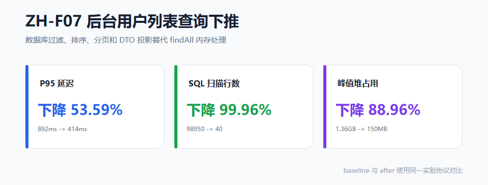

# ZH-F07 后台用户列表查询下推

## 1. 问题

后台用户列表 baseline 使用 `findAll` 后在内存中进行过滤、排序、分页，并在组织标签查询上存在 N+1 风险。随着用户数增长，查询延迟、SQL 扫描行数和 JVM 堆占用都会明显恶化。

## 2. 改造方案

将用户列表查询下推到 MySQL：

- `JpaSpecificationExecutor` 下推 username、role、orgTag 过滤。
- `Pageable` 下推分页与排序。
- 构造表达式 DTO 投影只返回必要字段，不返回 password。
- `findByTagIdIn` 批量查询组织标签，消除 N+1。
- 独立 count query 下推。

## 3. 核心结果

| 指标 | baseline | after | 变化 |
|---|---|---|---|
| 100k P95 延迟 | 892ms | 414ms | 降 53.59% |
| SQL 扫描行数 | 98950 | 40 | 降 99.96% |
| 峰值堆 | 1.36GB | 150MB | 降 88.96% |
| 响应等价 | - | 100% | PASS |



## 4. MME 判定

| 护栏 | 目标 | 实测 | 判定 |
|---|---|---|---|
| P95 延迟 | 100k 降 ≥30% | 降 53.59% | PASS |
| SQL 扫描行数 | 降 ≥80% | 降 99.96% | PASS |
| 峰值堆 | 降 ≥20% | 降 88.96% | PASS |
| 响应等价 | 100% | 100% | PASS |

## 5. 复现

```powershell
mysql -u root -p zhishu_exp_f07 < scripts/experiments/zhishu-admin-seed-100k.sql
mvn spring-boot:run "-Dspring-boot.run.profiles=experiment"
pwsh scripts/experiments/zhishu-admin-query.ps1
pwsh scripts/experiments/zhishu-admin-stat.ps1
pwsh scripts/experiments/zhishu-admin-verify.ps1
```

## 6. 证据

| 证据 | 值 |
|---|---|
| stat-summary sha256 | `1141D4DBD6AB355A48B87FD52E1CA80D35C4324A94D08A75953C0A377EB2847F` |
| verification-report sha256 | `16B4DEE1C2B1B3424C872A7BAE667C03BAE4CB2BD4DEB018D53D707FA72E9D67` |
| dataset manifest sha256 | `BC1946D6A2021AD493B1F4C6F24B2FA9B38755402AAA7CF91F0853E11C4E84C7` |

## 7. 边界

该结论绑定 100k 合成用户数据集、MySQL 8.0 和 experiment profile。它证明数据库下推在该场景下显著降低内存扫描和查询尾延迟，不代表所有业务查询都会获得相同比例收益。
